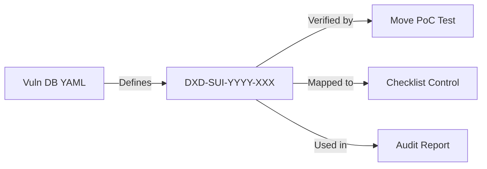

# DXD Audit Kit - Traceability Specification

This document defines the model for mapping vulnerability knowledge to actionable code verification (PoCs) and audit toolchains.

## 1. Vulnerability ID Format
The standard format for all findings in this repository is:
`DXD-SUI-YYYY-XXX`

- **DXD**: DXDLabs Prefix.
- **SUI**: Target Network (Sui).
- **YYYY**: Year of identification.
- **XXX**: Sequential 3-digit number.

## 2. Mapping Model
Every vulnerability entry MUST follow the **Spine Mapping** to ensure transparency and reproducibility:

### 2.1 Component Definitions:
1. **Vuln DB**: A machine-readable YAML file in `vuln-db/vulns/` containing severity, description, and remediation.
2. **Move PoC**: A buildable Move module in `tests/` that demonstrates the vulnerability (fails when vulnerable, passes with fix).
3. **Checklist Control**: A specific entry in `resources/move/checklists/` that auditors use to verify the risk manually.
4. **Audit Report**: A reference in a real-world client report (if applicable).

## 3. Example Entry
**ID**: `DXD-SUI-2026-001`
- **Name**: Shared Object Access Control Bypass
- **DB File**: `vuln-db/vulns/bluemove_unauthorized_take.yaml`
- **PoC File**: `tests/poc_bluemove_bypass.move`
- **Checklist**: `resources/move/checklists/move-audit-checklist.md` -> Section: Access Control

## 4. Maintenance
- All new entries must be registered in `vuln-db/summary.md`.
- CI will verify that each ID has a corresponding PoC test.
